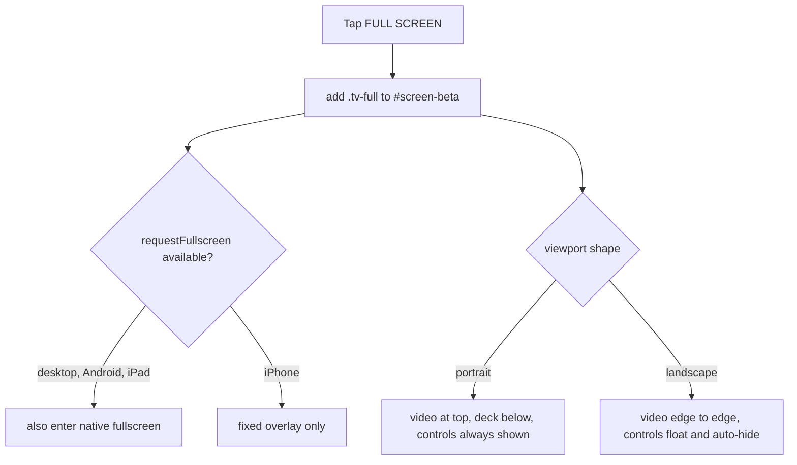

# Backlog

Ideas that are agreed but not built. Each entry carries enough detail to be
picked up cold, including the decisions already made and the constraints found
while investigating, so the same ground doesn't get covered twice.

---

## Fullscreen TV mode

**Status:** planned, not started
**Filed:** 2 Aug 2026

Give the beta TV a fullscreen mode that drops the cabinet but keeps the CRT
glass and the retro knobs. Video across the top with the control deck beneath
it in portrait, and edge-to-edge video with auto-hiding controls in landscape.

### Decisions already taken

- On a phone held upright, the video sits across the top at its natural shape
  and the retro control deck occupies the black space below it. Nothing ever
  covers the picture.
- In landscape the video fills the screen and the controls float on top,
  fading out after a few seconds and returning on a tap.
- The old-set character stays: the scanlines and vignette of `.tv-glass`
  remain over the picture, and the dial and power knob keep their existing
  look.

### The constraint that shapes all of this

`Element.requestFullscreen` does not exist on iPhone. Confirmed still true on
iOS 26 — iPad and desktop Safari have it, iPhone does not, and since every iOS
browser is WebKit underneath, Chrome on iPhone behaves the same. The only
native fullscreen there is `webkitEnterFullscreen` on a raw `<video>`, which
hands playback to Apple's own player and would throw away both the CRT look and
the channel controls.

So the mode cannot depend on the API. The mechanism is a CSS class, `tv-full`,
on `#screen-beta` that pins the tube to the viewport. Where the real API does
exist it is layered on top purely to hide browser chrome, with `fullscreenchange`
keeping the class in sync if the viewer escapes through browser UI. On iPhone
the browser's URL bar stays visible; there is no way around that short of
Add to Home Screen.

### Approach

No DOM moves between modes. The cabinet parts (`.tv-top`, `.tv-bezel` padding,
`.tv-legs`, `.tv-grille`, `.tv-brandblock`) are hidden by CSS, `.tv-screen` is
promoted to fill the viewport, and `.tv-deck` is repositioned.



**Portrait:** `.tv-screen` becomes full width pinned to the top with
`aspect-ratio:16/9`, and `.tv-deck` sits in the black below it. Because the deck
has its own space, controls stay visible and the idle fade is disabled.

**Landscape:** `.tv-screen` fills `100dvw`/`100dvh`, and `.tv-deck` becomes a
translucent floating strip centred at the bottom holding only the dial and the
power knob.

### Aspect handling

The YouTube crop in `public/style.css` is hardcoded to the 3:2 tube
(`left:-9.2593%;width:118.519%`) and breaks at any other shape. In fullscreen,
replace it with the standard full-bleed technique, which needs no JavaScript:

```css
.tv-full .tv-yt-holder iframe{
  top:50%; left:50%; transform:translate(-50%,-50%);
  width:100%; height:56.25dvw;
  min-height:100%; min-width:177.78dvh;
}
```

For uploaded clips, `#tv-video` uses `object-fit:contain` in portrait so the
whole frame sits above the deck, and `cover` in landscape so it truly fills the
screen. Note that `cover` crops the sides of 16:9 on a very wide phone; it is a
one-line switch to `contain` if never losing picture matters more.

### Auto-hide

An inactivity timer in `public/beta.js` adds `tv-idle` after about three
seconds, cleared by any `pointerdown`, `mousemove` or `keydown`. The fade is
scoped inside the landscape media query so portrait is unaffected. It rides
alongside the existing unmute-on-tap listener without conflict, since both
simply respond to the same tap.

### iPhone specifics

- Add `viewport-fit=cover` to the viewport meta in `public/index.html`,
  currently `width=device-width, initial-scale=1.0`, so safe-area insets
  resolve at all.
- Pad the floating deck with `env(safe-area-inset-bottom)` and the exit button
  with `env(safe-area-inset-top)`.
- Use `100dvh`, not `100vh`, so the collapsing URL bar does not cut the picture.
- Lock body scroll while the mode is active.

### Wiring

- A `FULL SCREEN` control added to `.tv-deck` beside the power knob, matching
  the existing `.tv-control` markup, plus a collapse button inside `.tv-screen`
  for the way out.
- Escape exits, and the `showScreen` wrapper in `public/beta.js` exits on
  leaving the beta screen, alongside its existing `tvPowerOff` and modal
  cleanup.
- Call `tvLayoutTicks()` after every toggle. It derives tick radius from
  `tvRing.clientWidth`, so a resized dial would otherwise leave the channel
  numbers sitting in the wrong ring.

### Verification

Drive a headless browser at desktop, iPhone portrait (390x844) and iPhone
landscape (844x390). Confirm the video fills as intended in each, controls stay
reachable, the deck clears the home indicator, YouTube and uploaded clips both
fill correctly, controls fade and return on tap in landscape only, and that
both Escape and the collapse button restore the cabinet.
